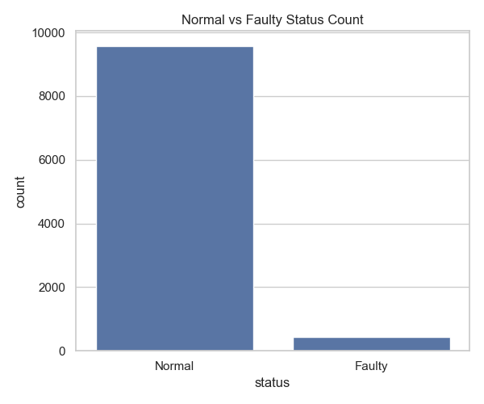
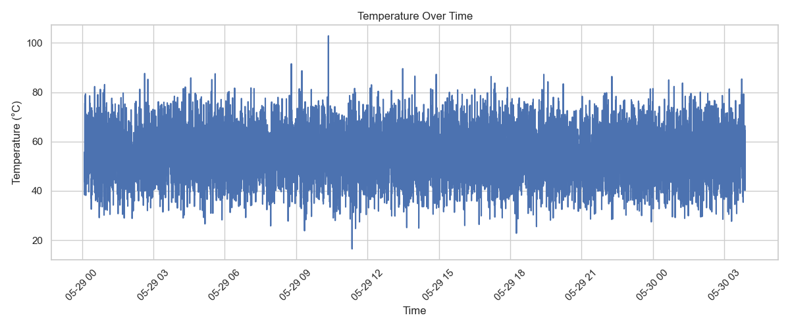

#  Predictive Safety Monitoring for EV Systems

A beginner-friendly real-time machine learning project to monitor electric vehicle (EV) health using anomaly detection and dashboarding.

# Project Overview

This AI Safety Monitor analyzes EV sensor data and identifies anomalies using Isolation Forest. The system assigns alert levels like Safe, Warning, and Critical, then visualizes the results in an interactive Streamlit dashboard.

# Features

-  Unsupervised anomaly detection with Isolation Forest
-  Visualizations for temperature, vibration, voltage trends
-  Rule-based alert tagging
-  Interactive filters and export options in the dashboard
-  Fully beginner-friendly and industry-relevant

# Tech Stack

- Python
- Pandas
- Scikit-learn
- Matplotlib
- Streamlit

# Project Structure

- app/ – Streamlit dashboard 
  - dashboard.py

- scripts/
  - train_model.py – Isolation Forest training
  - alert_logic.py – Rule-based alert tagging
  - visualize_data.py – Sensor visualizations
  - visualize_alerts.py – Alert-level plots

- models/ 
  - anomaly_model.pkl
  - scaler.pkl
- data/ – Raw and processed CSV files
  - ev_sensors.csv
  - ev_sensors_with_anomaly.csv
  - ev_sensors_alerts.csv
- data images
- requirements.txt – Python dependencies
- README.md 

# How to Run
bash
# Create a virtual environment (if needed)
python -m venv .venv
source .venv/bin/activate  # or .\.venv\Scripts\activate on Windows
# Install requirements
pip install -r requirements.txt
# Launch the dashboard
streamlit run app/dashboard.py

# Output Preview

  

